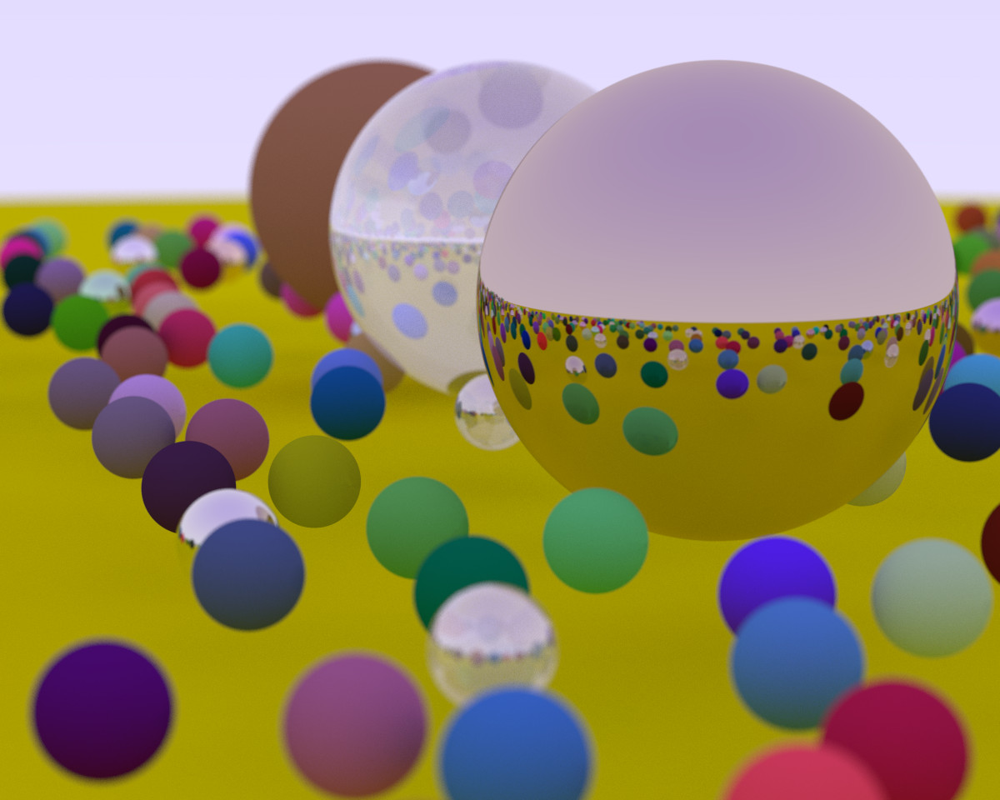

# ray-tracing-weekend

Ray tracing in one weekend, but it is in Rust. This will not finish in a single weekend.



## Features

### Base Features

The features that all projects that are based on ray tracing in one weekend are:

- Rendering of spheres
- Rendering of reflections and shadows
- Rendering of refraction
- Rendering of different materials
  - lambertian
  - metals
  - dielectrics
- Rendering the scene from different camera positions
- Rendering different camera field of view
- Rendering depth of field

### Differences

Instead of using an existing rust library that would implement the vector
operations required, I implemented those vectors myself to learn how you
would do so in rust.

These implementation have brief unit tests.

## Running the program

Currently the program will just spit out ppm format image into the terminal. If
you actually wish to view the image, please pipe the output into a file.

### Example of piping the output into a file

Here is an example of how to run the program, and save it to a file called `image.ppm`.

```bash
cargo run > image.ppm
```

## Tasks

- [x] Add Lambertian Reflection
- [x] Allow materials to be colored
- [x] Add new materials
  - [x] Add metals
  - [x] Add fuzzy metals
  - [x] Add glass metals
- [x] Make the camera adjustable
- [x] Add a defocused effect
- [x] Make a threaded computation mode
- [ ] Make a wgpu mode
