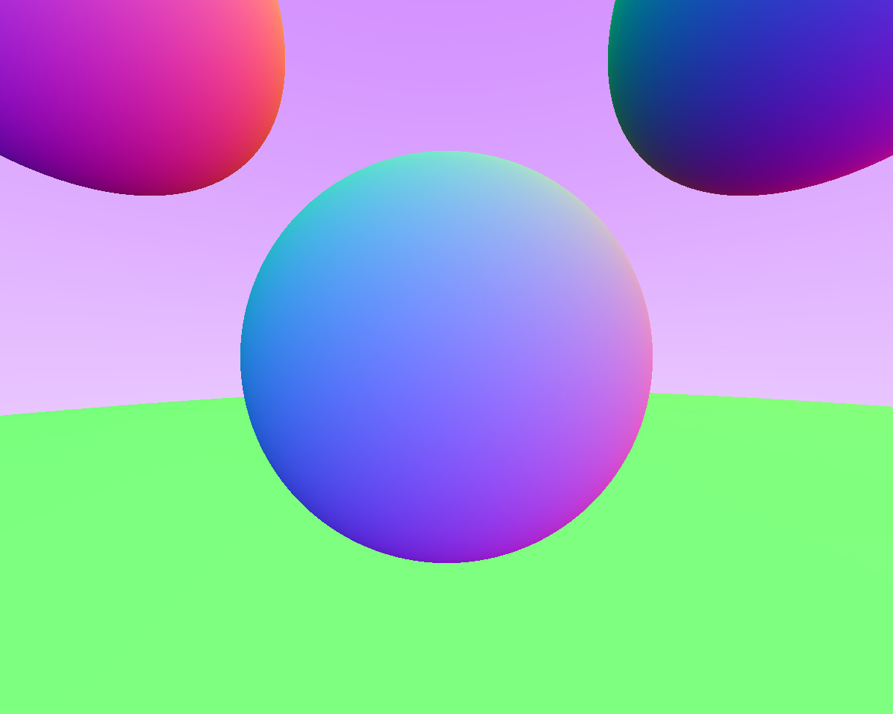
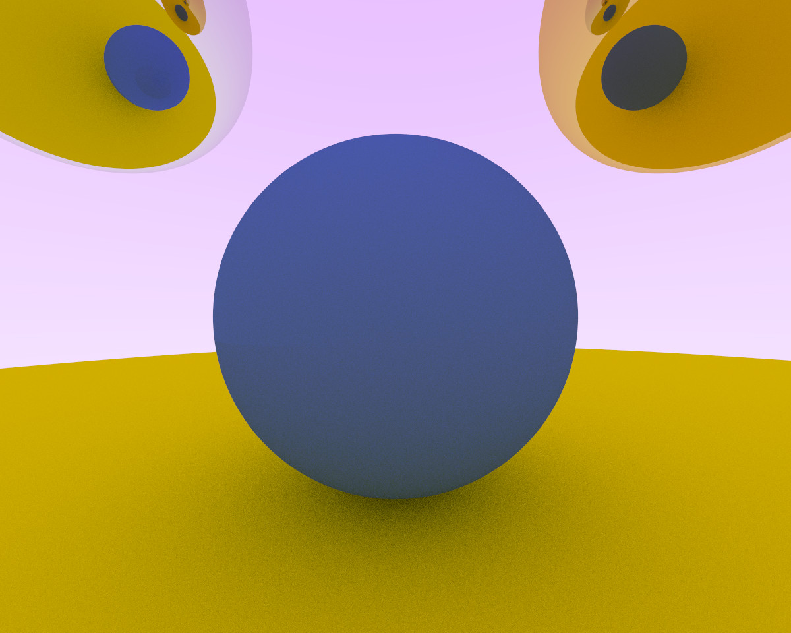
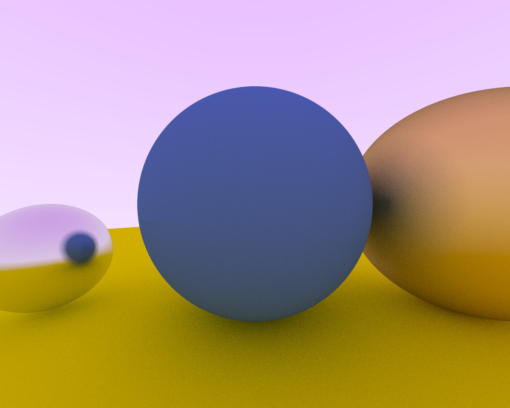
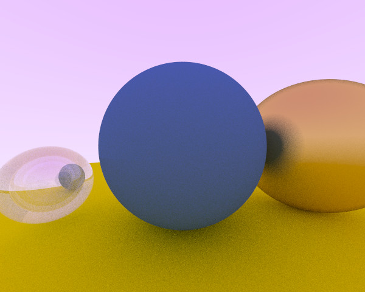
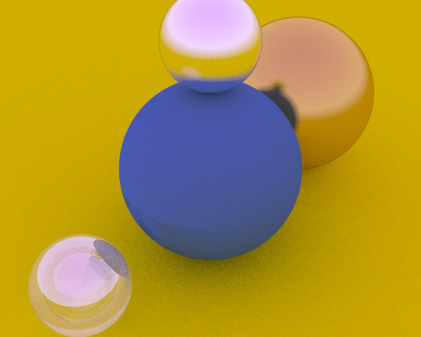

# ray-tracing-weekend

Ray tracing in one weekend, but it is in Rust. This will not finish in a single weekend.

## Running the program

Currently the program will just spit out ppm format image into the terminal. If
you actually wish to view the image, please pipe the output into a file.

### Example of piping the output into a file

Here is an example of how to run the program, and save it to a file called `image.ppm`.

```bash
cargo run > image.ppm
```

## Program Capabilities

Program able to generate basic matte shadows.

## Features

- [X] Add Lambertian Reflection
- [X] Allow materials to be colored
- [X] Add new materials
  - [X] Add metals
  - [X] Add fuzzy metals
  - [X] Add glass metals
- [ ] Make the camera adjustable
- [ ] Make a threaded computation mode
- [ ] Make a wgpu mode

## Outputs

### Shading by Normal


### With multiple objects



### With Anti-Aliasing


### Basic Working Matt Shadows


### Other materials



#### Fuzzy metals



#### Hollow glass



### Camera Adjustments

#### High angle with 30 vfov



## Resources

[_Ray Tracing in One Weekend_](https://raytracing.github.io/books/RayTracingInOneWeekend.html)
