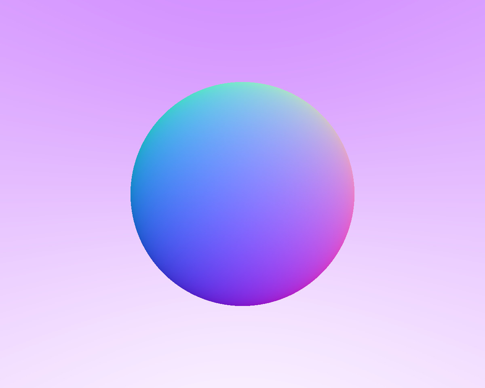
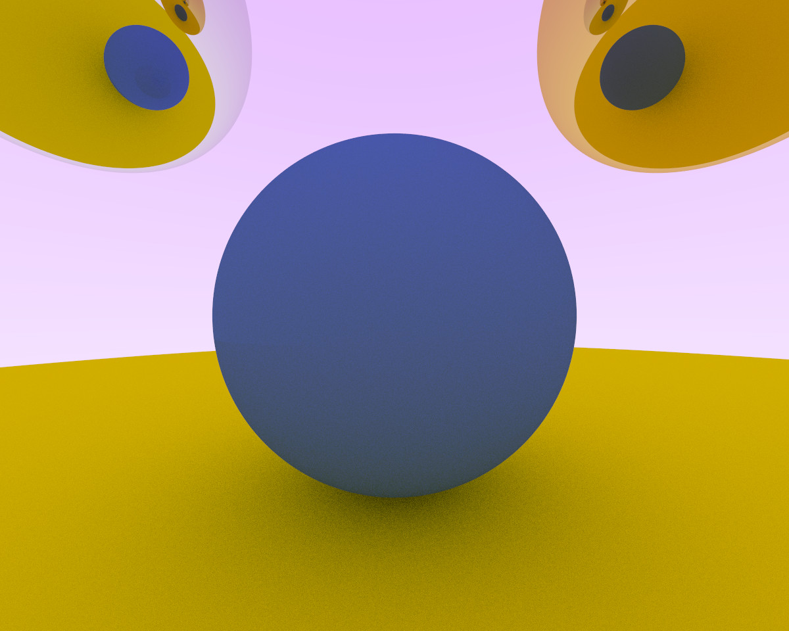
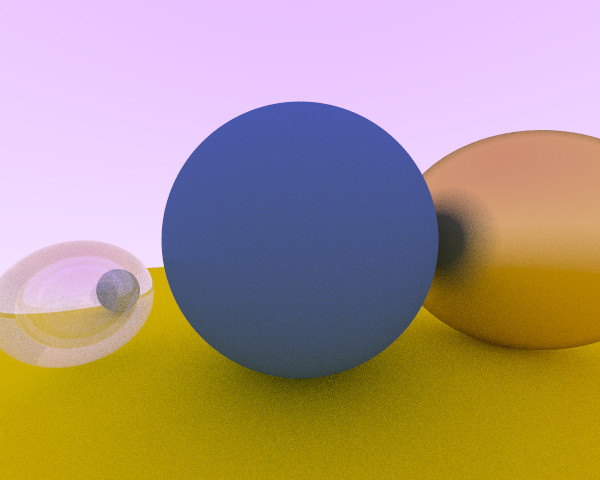

# Image Archive

## Shading by Normal

## With multiple objects

## With Anti-Aliasing

## Basic Working Matt Shadows

## Other materials

### Fuzzy metals

### Hollow glass

## Camera Adjustments

### High angle with 30 vfov

## Resources

[_Ray Tracing in One Weekend_](https://raytracing.github.io/books/RayTracingInOneWeekend.html)
